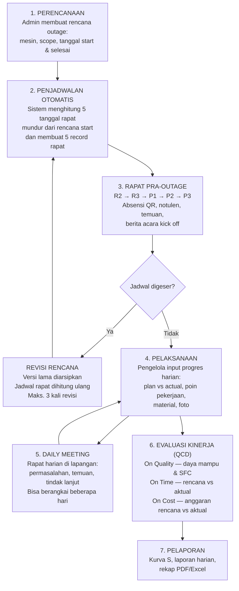
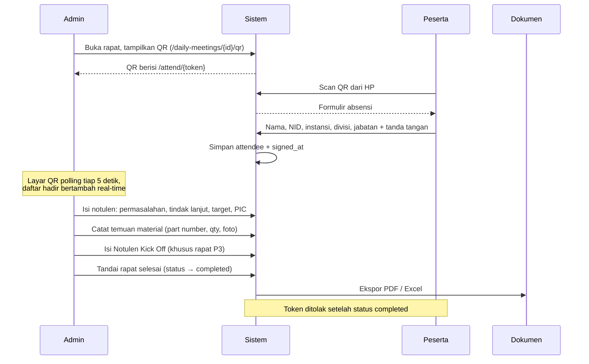

# Konsep Aplikasi — Online Monitoring Outage Management

Dokumen ini menjelaskan *apa* aplikasi ini, *siapa* penggunanya, dan *bagaimana* alurnya berjalan dari perencanaan sampai evaluasi. Untuk struktur tabel dan kolom, lihat [database.md](database.md).

---

## Daftar Isi

1. [Ringkasan](#1-ringkasan)
2. [Masalah yang Diselesaikan](#2-masalah-yang-diselesaikan)
3. [Aktor & Peran](#3-aktor--peran)
4. [Entitas Inti](#4-entitas-inti)
5. [Alur Utama: Siklus Hidup Outage](#5-alur-utama-siklus-hidup-outage)
6. [Alur A — Perencanaan & Penjadwalan](#6-alur-a--perencanaan--penjadwalan)
7. [Alur B — Rapat Outage (Pra-Pelaksanaan)](#7-alur-b--rapat-outage-pra-pelaksanaan)
8. [Alur C — Daily Meeting (Saat Pelaksanaan)](#8-alur-c--daily-meeting-saat-pelaksanaan)
9. [Alur D — Input Progres oleh Pelaksana](#9-alur-d--input-progres-oleh-pelaksana)
10. [Alur E — Evaluasi Kinerja (QCD)](#10-alur-e--evaluasi-kinerja-qcd)
11. [Peta Menu & Hak Akses](#11-peta-menu--hak-akses)
12. [Aturan Bisnis Penting](#12-aturan-bisnis-penting)
13. [Keluaran Dokumen](#13-keluaran-dokumen)
14. [Arsitektur Teknis](#14-arsitektur-teknis)
15. [Status Pengembangan](#15-status-pengembangan)
16. [Catatan Penamaan yang Perlu Diwaspadai](#16-catatan-penamaan-yang-perlu-diwaspadai)

---

## 1. Ringkasan

**Outage Monitoring** adalah aplikasi web untuk memantau dan mengelola pekerjaan *outage* (pemeliharaan besar / overhaul) pembangkit listrik secara daring, dari tahap perencanaan sampai evaluasi kinerja pasca-pekerjaan.

Aplikasi ini mengganti cara kerja berbasis berkas Excel dan berkas notulen tercecer menjadi satu sistem tunggal yang:

- Menyimpan **satu sumber kebenaran** untuk jadwal outage seluruh mesin.
- Menghitung **jadwal rapat pra-outage secara otomatis** dari tanggal rencana mulai.
- Mengumpulkan **progres harian** langsung dari pihak pelaksana di lapangan, lengkap dengan foto dan material terpakai.
- Mencatat **kehadiran rapat lewat QR code** dan tanda tangan digital.
- Menghasilkan **notulen dan laporan siap cetak** (PDF/Excel) tanpa mengetik ulang.
- Mengukur keberhasilan outage lewat kerangka **QCD** (Quality, Cost, Time).

Cakupan wilayah pada konfigurasi berjalan: **PLN UP Kendari**, mencakup pembangkit PLTD, PLTM, PLTMG.

---

## 2. Masalah yang Diselesaikan

| Masalah lama | Cara aplikasi mengatasinya |
|---|---|
| Jadwal outage tersebar di banyak berkas Excel, versi tidak jelas mana yang berlaku | Satu tabel rencana + riwayat revisi bernomor (RENC, REV 1–3) |
| Tanggal rapat pra-outage dihitung manual, sering meleset saat jadwal digeser | Dihitung otomatis dari rencana start dengan rumus tunggal (`JadwalRapatOutage`) |
| Rapat digeser tapi undangan rapatnya tidak ikut berubah | Rapat disinkronkan otomatis lewat model hook setiap jadwal berubah |
| Daftar hadir rapat pakai kertas, tanda tangan sulit direkap | Absensi QR code — peserta scan, isi, tanda tangan di layar HP |
| Progres pekerjaan dilaporkan lewat WhatsApp/chat, tidak terekap | Pelaksana input progres harian langsung ke sistem, per poin pekerjaan |
| Notulen diketik ulang tiap rapat | Formulir notulen dengan nilai bawaan otomatis, ekspor PDF/Excel sekali klik |
| Tidak ada ukuran objektif apakah outage berhasil | Modul Kinerja QCD: daya mampu & SFC sebelum/sesudah, biaya rencana vs aktual, waktu rencana vs aktual |
| Tidak jelas siapa mengubah apa | Jejak aktivitas otomatis untuk seluruh modul |

---

## 3. Aktor & Peran

Sistem mengenal **empat peran** (`users.role`) plus satu aktor publik tanpa akun.

### 3.1 Super Admin (`super_admin`)

Akses penuh. Satu-satunya peran yang bisa membuka:

- **Data Master** — kelola user & hak akses, unit & mesin, material, tanda tangan global
- **Aktivitas** — jejak audit seluruh peran (baca saja)

### 3.2 Admin (`admin`)

Mengelola operasional harian seluruh merek mesin. Boleh menambah, mengubah, dan **menghapus** catatan induk (jadwal outage, rapat). Tidak dibatasi merek.

### 3.3 Pengelola (`pengelola`) — pihak pelaksana / vendor

Peran inilah yang dipakai **pihak pelaksana pekerjaan untuk menginput progres mereka sendiri**. Karakteristiknya:

- Terikat pada **satu merek mesin** (`users.merek`) — misalnya CUMMINS, MIRRLEES, DEUTZ.
- Hanya melihat dan mengisi rencana outage untuk mesin merek tersebut. Semua dashboard, daftar, dan laporan otomatis tersaring (`OutagePlan::scopeVisibleTo`).
- **Boleh**: mengisi progres harian, uraian pekerjaan, material terpakai, foto dokumentasi, dan realisasi.
- **Tidak boleh**: menghapus jadwal outage atau rapat (menghapus satu jadwal ikut membuang seluruh riwayat progres, foto, dan notulennya — tidak bisa dibatalkan).
- **Tidak boleh**: menggeser tanggal rencana maupun jadwal rapat — itu ditetapkan terpusat. Kalau formulirnya terlanjur mengirim kolom jadwal, kolom itu **dibuang diam-diam** dari payload, bukan ditolak, supaya menyimpan progres tidak pernah gagal karenanya.
- **Tidak melihat** menu Rapat Outage dan Daily Meeting — rapat dikoordinasi terpusat, bukan per merek.

> **Catatan istilah**: dalam kode tidak ada peran bernama `vendor`. Fungsi "vendor menginput progres pekerjaannya" dijalankan oleh peran `pengelola` yang dibatasi per merek mesin. Kalau ke depan vendor perlu dibedakan dari pengelola internal, itu peran baru — bukan yang sudah ada.

### 3.4 Tamu (`tamu`)

Pengamat. Boleh melihat seluruh data, **tidak boleh menulis apa pun** (`canWrite()` = false). Tidak dibatasi merek.

### 3.5 Peserta Rapat (tanpa akun)

Siapa pun yang memindai QR code rapat. Mengakses rute publik tanpa login:

- `/attend/{token}` — absensi Rapat Outage
- `/daily-briefings/attend/{token}` — absensi Daily Meeting

Hanya bisa mendaftarkan kehadiran dan membubuhkan tanda tangan. Token ditolak kalau rapat sudah berstatus `completed`.

### 3.6 Pengunjung Halaman Publik

Halaman depan (`/`) terbuka tanpa login, menampilkan kondisi mesin secara agregat: total outage, status, sebaran jenis/sistem/scope, dan agenda rapat terdekat. Angkanya memakai sumber statistik yang sama dengan dashboard (`OutageStats`) supaya kedua halaman mustahil berbeda. Token absensi dan tautan meeting sengaja **tidak** ikut dipublikasikan.

### 3.7 Hak akses per menu

Di atas peran, tiap akun bisa dibatasi lebih jauh lewat `users.menu_access` (JSON daftar kunci menu). Middleware `CheckMenuAccess` memeriksanya per rute. Bernilai `null` berarti tidak dibatasi. Super Admin selalu lolos.

---

## 4. Entitas Inti

```
Unit (sentral/lokasi)
 └── Mesin (spesifikasi penggerak, generator, trafo)

OutagePlan  ← inti aplikasi: satu rencana pekerjaan outage satu mesin
 ├── OutagePlanRevision   riwayat versi rencana (RENC, REV 1–3)
 ├── OutagePlanProgress   progres harian + work items + spare parts + foto
 ├── KinerjaQuality       daya mampu & SFC sebelum vs sesudah
 ├── KinerjaCost          anggaran rencana vs aktual
 ├── KinerjaTime          tanggal rencana vs aktual
 └── DailyMeeting (×5)    rapat R2, R3, P1, P2, P3 — dibuat otomatis
      ├── MeetingAttendee     daftar hadir + tanda tangan
      ├── MeetingIssue        permasalahan & tindak lanjut
      ├── MeetingFinding      temuan material
      ├── MeetingMinute       notulen umum
      └── MeetingKickoff      berita acara kick off (+ foto dokumentasi)

DailyBriefing  ← rapat harian saat pekerjaan berjalan (berdiri sendiri)
 ├── parent_id → DailyBriefing   rangkaian rapat multi-hari
 ├── DailyBriefingAttendee
 ├── DailyBriefingIssue
 ├── DailyBriefingFinding
 └── DailyBriefingKickoff (+ foto)

Material     master spare part
Setting      konfigurasi key–value (mis. penandatangan global)
ActivityLog  jejak audit seluruh modul
```

---

## 5. Alur Utama: Siklus Hidup Outage



---

## 6. Alur A — Perencanaan & Penjadwalan

**Menu: Perencanaan dan Jadwal** (`/outage-plans`)

### Langkah

1. Admin membuat rencana outage: mesin pembangkit, scope pekerjaan, jenis pembangkit, sistem, tanggal rencana start dan selesai.
2. Sistem **menurunkan merek mesin secara otomatis** dari nama mesin. Merek diambil dari kelompok tanda kurung pertama — `PLTD POASIA #02 (MIRRLEES)` → `MIRRLEES`. Kelompok yang diawali `EX` dilewati karena itu catatan lokasi lama, bukan merek. Mesin tanpa merek jatuh ke jenis pembangkitnya (`PLTM WINNING #02` → `PLTM`). Variasi ejaan dilipat jadi satu (`MIRRLESS` → `MIRRLEES`, `CUMMINS QSK` → `CUMMINS`) supaya satu mesin tidak terpecah ke dua akun pengelola.
3. Merek inilah yang menentukan **akun pengelola mana yang berhak mengisi progres** mesin tersebut.
4. Durasi dihitung dari selisih start–selesai (hari start dan finish ikut dihitung).

### Penjadwalan rapat otomatis

Kelima rapat pra-outage dihitung **mundur dari tanggal rencana start**:

| Rapat | Mundur dari start |
|---|---|
| **R2** | 365 hari (± 1 tahun sebelum) |
| **R3** | 180 hari (± 6 bulan sebelum) |
| **P1** | 90 hari (± 3 bulan sebelum) |
| **P2** | 30 hari (± 1 bulan sebelum) |
| **P3** | 7 hari (± 1 minggu sebelum) — sekaligus *Kick Off Meeting* |

Rumusnya ada di satu tempat (`app/Support/JadwalRapatOutage.php`) supaya backend, formulir revisi, dan pratinjau di layar tidak pernah memakai angka yang berbeda diam-diam.

### Sinkronisasi rapat

Setiap kali kolom `rapat_*` pada rencana berubah, model hook (`OutagePlan::booted`) otomatis:

- **Membuat atau memperbarui** record `DailyMeeting` untuk tipe rapat tersebut — judul, tanggal, jam 09:00, lokasi Online, dan tautan Zoom bawaan.
- **Menghapus** rapat kalau tanggalnya dikosongkan.

Saat rencana dihapus, rapatnya ikut dihapus lewat hook `deleting` — bukan `deleted`, karena foreign key-nya `nullOnDelete` sehingga pada `deleted` relasinya sudah kosong dan rapatnya akan tertinggal yatim.

### Revisi rencana

Jadwal boleh digeser, tapi **maksimal 3 kali** (`OutagePlan::MAKS_REVISI`). Rencana yang sudah tiga kali digeser dianggap perlu ditinjau ulang, bukan direvisi lagi diam-diam.

Mekanismenya:

1. Sebelum perubahan pertama, kondisi yang sedang berlaku diabadikan sebagai **urutan 0 = "RENC" (rencana awal)** — supaya revisi pertama punya pembanding.
2. Rencana baru diterapkan, kelima tanggal rapat dihitung ulang.
3. Versi barunya dicatat sebagai REV 1, REV 2, dst. lengkap dengan siapa yang mencatat dan catatannya.

Riwayat hanya disentuh kalau jadwalnya **memang bergeser** — menyimpan progres harian saja tidak meninggalkan jejak revisi. Perbandingannya memotong tanggal ke `YYYY-MM-DD` supaya beda format tidak terbaca sebagai perubahan.

Ada dua pintu masuk revisi: formulir khusus di menu Rapat Outage (`catatRevisi()` — hanya minta start & finish, jadwal rapat dihitung sendiri) dan halaman Ubah Data Pekerjaan (`catatVersiBerjalan()` — menyimpan dulu lalu merekam hasilnya). Batas 3 revisi berlaku di **kedua** jalur.

---

## 7. Alur B — Rapat Outage (Pra-Pelaksanaan)

**Menu: Rapat Outage** (`/daily-meetings`) — tidak tampil untuk pengelola.

Halaman ini menampilkan daftar rencana outage beserta status kelima rapatnya, dengan filter per jenis rapat (P1, P2, P3, R2, R3) dan hitungan jumlah revisi.

### Alur satu rapat



### Yang dicatat dalam satu rapat

| Bagian | Isi |
|---|---|
| **Daftar Hadir** | Nama, NID, instansi, divisi, jabatan, tanda tangan digital (base64), waktu tanda tangan |
| **Notulen / Issue** | Permasalahan, tindak lanjut, target, PIC, status Open/Close |
| **Temuan** | Uraian, part number, qty, satuan, foto, keterangan, tindak lanjut, status |
| **Notulen Kick Off** | Kontrol dokumen, header rapat, penyampaian PLN, penyampaian mitra, hasil kesepakatan, lampiran, tanda tangan pimpinan & notulis |
| **Dokumentasi** | Foto kegiatan beserta caption |

### Notulen Kick Off terisi otomatis

Agar formulir tidak kosong saat pertama dibuka, sistem menurunkan nilai bawaan dari rapat dan rencananya: nomor dokumen, pimpinan rapat, tempat, waktu, agenda (`Kick Off Meeting Pelaksanaan Pekerjaan OH {scope} {mesin}`), dan penandatangan tetap. Penandatangan global bisa diubah Super Admin lewat **Data Master → Tanda Tangan**, dan berlaku ke seluruh berkas yang butuh tanda tangan.

### Realisasi rapat

Tanggal rapat yang direncanakan bisa berbeda dari tanggal pelaksanaan sebenarnya. Kolom `tanggal_realisasi` mencatat kapan rapat betul-betul terjadi, terpisah dari `tanggal` rencananya.

---

## 8. Alur C — Daily Meeting (Saat Pelaksanaan)

**Menu: Daily Meeting** (`/daily-briefings`) — tidak tampil untuk pengelola.

Berbeda dari Rapat Outage yang terikat rencana dan otomatis terjadwal, Daily Meeting adalah **rapat harian di lapangan selama pekerjaan berjalan**, dibuat manual.

### Yang membedakannya

**Header formulir inspeksi sendiri**: unit, jenis inspeksi, rapat framework, tanggal performance test, jam operasi setelah PO terai, daya mampu — plus blok kontrol dokumen dan dua penandatangan (mengetahui & disetujui).

**Rapat berangkai lintas hari**: satu rapat bisa berlangsung beberapa hari untuk mesin yang sama. Tombol **Tambah Hari** membuat catatan baru yang:

- Menunjuk hari pertama lewat `parent_id` (hari pertama sendiri bernilai `null`)
- Mewarisi identitas mesin dan kop dokumen dari hari sebelumnya
- Mengambil tanggal = tanggal terakhir dalam rangkaian + 1 hari
- Punya **notulen dan daftar hadir sendiri** — bukan lanjutan yang ditumpuk

Dengan begitu tiap hari tetap terdokumentasi terpisah, tapi rangkaiannya tetap terbaca sebagai satu kesatuan.

**Absensi mandiri**: selain QR, tersedia tautan absensi yang bisa dibagikan untuk peserta yang tidak memindai. Tautan yang sama ikut dicantumkan pada lampiran notulen.

Sisanya (temuan, issue, kick off, dokumentasi, ekspor) mencerminkan modul Rapat Outage.

---

## 9. Alur D — Input Progres oleh Pelaksana

**Menu: Perencanaan dan Jadwal → Ubah Data Pekerjaan** (`/outage-plans/{id}/edit`)

Inilah menu tempat **pihak pelaksana menginput progres pekerjaan mereka**. Akun `pengelola` masuk, dan hanya melihat mesin merek yang dikelolanya.

### Yang diinput per hari

Satu baris progres per rencana per tanggal (dijamin unik oleh constraint database):

| Field | Keterangan |
|---|---|
| **Plan progress** | Progres rencana hari itu (%) |
| **Actual progress** | Progres aktual hari itu (%) |
| **Work items** | Daftar berpoin — tiap poin punya uraian dan progresnya sendiri |
| **Spare parts** | Daftar material — nama, part number, qty, keterangan |
| **Keterangan** | Catatan harian |
| **Foto** | Beberapa foto per hari, maks. 5 MB per berkas |

### Perilaku yang perlu diketahui

**Hari yang belum diisi tersimpan sebagai `NULL`, bukan 0.** Ini keputusan sadar. Sebelumnya kolomnya `NOT NULL DEFAULT 0`, dan karena progres bersifat kumulatif, aturan "tidak boleh turun" membaca 0 di hari 12 (sementara hari 11 sudah 45%) sebagai penurunan — rencananya jadi tidak bisa disimpan lagi selamanya. Mengosongkan kolom pun tidak menolong karena kembali jadi 0 pada simpan berikutnya.

**Progres keseluruhan dihitung otomatis.** Karena kumulatif, nilai aktual tertinggi yang pernah tercatat menjadi progres rencana secara keseluruhan (`outage_plans.progress`) — sehingga setiap daftar dan dashboard yang membaca kolom itu selalu sinkron.

**Baris kosong dibuang.** Menambah poin pekerjaan lalu membatalkannya tidak meninggalkan baris hampa di laporan.

**Foto yang dilepas ikut dihapus dari disk.** Tanpa ini setiap penghapusan menyisakan berkas yatim yang tidak dirujuk siapa pun tapi terus memakan penyimpanan.

**Kolom jadwal dibuang dari payload pengelola**, bukan ditolak — supaya menyimpan progres harian tidak pernah gagal hanya karena formulirnya ikut membawa tanggal rencana.

### Keluaran dari data ini

- **Kurva S** — perbandingan kurva plan vs actual sepanjang durasi pekerjaan
- **Laporan Kegiatan Harian** — satu berkas per tanggal (PDF & Excel), berisi uraian pekerjaan, material, foto dokumentasi, dan kurva S
- **Rekap keseluruhan** — PDF & Excel per rencana outage

---

## 10. Alur E — Evaluasi Kinerja (QCD)

**Menu: Kinerja Outage**

Setelah pekerjaan selesai, keberhasilannya diukur dari tiga sisi.

### On Quality (`/kinerja/on-quality`)

Membandingkan performa mesin **sebelum vs sesudah** outage:

- **DM (Daya Mampu)** — diharapkan naik
- **SFC (Specific Fuel Consumption)** — diharapkan turun

Masing-masing disertai berkas eviden. Sistem menghitung persentase kenaikan DM dan penurunan SFC, lalu menilai tercapai atau tidak. Rumusnya ada di model supaya identik dengan yang dipakai dashboard.

Presisinya `decimal(14,4)` — bukan dua desimal — karena SFC lazim ditulis sampai tiga–empat angka di belakang koma (mis. 0,2145 liter/kWh) dan pembulatan di situ langsung menggeser hasil persentasenya.

Status "Lengkap" berarti pembacaan sebelum **dan** sesudah sudah terisi.

### On Time (`/kinerja/on-time`)

Tanggal start dan selesai aktual vs rencana, plus eviden dan catatan.

### On Cost (`/kinerja/on-cost`)

Anggaran rencana vs anggaran aktual, plus eviden.

### Penyajian eviden

Berkas eviden **tidak** disajikan lewat `/storage` publik. Ada penyaji khusus (`/kinerja/eviden/{jenis}/{id}/{tipe?}`) yang membacanya dari disk privat, sehingga berkas hanya bisa diakses lewat sesi yang terautentikasi.

---

## 11. Peta Menu & Hak Akses

| Kelompok | Menu | Rute | Akses |
|---|---|---|---|
| **Monitoring** | Dashboard | `/dashboard` | Semua (tersaring merek) |
| | Summary | `/summary` | Semua — *dalam pengembangan* |
| **Perencanaan & Pelaksanaan** | Perencanaan dan Jadwal | `/outage-plans` | Semua (tersaring merek) |
| | Rapat Outage | `/daily-meetings` | Kecuali pengelola |
| | Daily Meeting | `/daily-briefings` | Kecuali pengelola |
| **Kinerja Outage** | On Quality | `/kinerja/on-quality` | Semua |
| | On Time | `/kinerja/on-time` | Semua |
| | On Cost | `/kinerja/on-cost` | Semua |
| | On Scope | `/kinerja/on-scope` | Semua — *dalam pengembangan* |
| | On Safety | `/kinerja/on-safety` | Semua — *dalam pengembangan* |
| **Data Master** | Users & Hak Akses | `/master/users` | Super Admin |
| | Data Unit & Mesin | `/master/units` | Super Admin |
| | Data Material | `/master/materials` | Super Admin |
| | Tanda Tangan | `/master/ttd` | Super Admin |
| | Aktivitas | `/aktivitas` | Super Admin |
| **Footer** | Team Outage | `/team-outage` | Semua |
| **Publik** | Landing page | `/` | Tanpa login |
| | Absensi rapat | `/attend/{token}` | Tanpa login |
| | Absensi briefing | `/daily-briefings/attend/{token}` | Tanpa login |

### Tiga lapis pemeriksaan akses

1. **Peran** — `EnsureSuperAdmin` untuk Data Master & Aktivitas; gate `viewMeetings` untuk modul rapat.
2. **Menu** — `CheckMenuAccess` mencocokkan nama rute dengan daftar `users.menu_access`.
3. **Data** — `OutagePlan::scopeVisibleTo()` menyaring baris per merek, dan pemeriksaan otorisasi diulang di controller (bukan hanya menyembunyikan tombol di layar, karena rutenya tetap bisa dipanggil langsung).

---

## 12. Aturan Bisnis Penting

### Jadwal rapat selalu turunan dari rencana start

Kelima rapat tidak pernah diinput manual — sekali rencana start digeser, semuanya ikut bergeser. Ini mencegah kondisi jadwal rapat menunjuk ke tanggal yang sudah tidak relevan.

### Revisi rencana dibatasi 3 kali

RENC (urutan 0) lalu REV 1–3. Berlaku di kedua jalur perubahan jadwal. Setelah batas tercapai, jadwal tidak bisa diubah lagi — **tapi data lain tetap bisa disimpan**, jadi progres harian tidak ikut terkunci.

### Progres bersifat kumulatif dan tidak boleh turun

Konsekuensinya: hari yang belum diisi harus `NULL`, dan nilai tertinggi = progres keseluruhan.

### Status pekerjaan hanya OPEN atau CLOSE

Dulu kolom teks bebas. Dijadikan daftar tertutup supaya filter dan hitungan status tidak meleset gara-gara variasi ejaan yang masuk lewat request langsung.

### Satu mesin = satu merek = satu akun pengelola

Variasi ejaan merek dilipat lewat tabel alias agar satu mesin tidak terpecah ke dua akun.

### Menghapus rencana membuang seluruh turunannya

Progres harian, revisi, kinerja QCD, dan seluruh rapat beserta notulen, daftar hadir, dan fotonya. Karena itu hanya admin yang boleh menghapus — pengelola tidak. Menghapus temuan atau foto notulen tetap boleh untuk pengelola, karena itu bagian dari mengoreksi isian mereka sendiri.

### Unit tidak bisa dihapus selama masih punya mesin

Foreign key `mesin.id_unit` memakai `restrict`.

### Pencatatan audit tidak boleh menggagalkan operasi

`ActivityLogger` menempel lewat service provider (tidak ada controller yang perlu diubah), dan seluruh isinya dibungkus try/catch — kegagalan pencatatan cukup masuk log aplikasi, tidak membatalkan aksinya.

Nama dan peran pelaku **disalin** ke barisnya, bukan hanya dirujuk lewat `user_id`, supaya catatan lama tetap terbaca setelah akun dihapus atau perannya berganti. Kolom besar atau rahasia (foto, tanda tangan, kata sandi, token) hanya ditandai berubah tanpa ikut disalin.

### Angka publik dan angka dashboard wajib sama

Halaman depan dan dashboard memakai satu kelas statistik (`OutageStats`) dengan default tahun yang sama. Sebelumnya keduanya menghitung dengan kode yang disalin, dan salinan seperti itu cepat menyimpang — satu halaman diperbaiki, satunya terlupa.

---

## 13. Keluaran Dokumen

Setiap modul bisa mengeluarkan berkas siap cetak:

| Dokumen | Format | Sumber |
|---|---|---|
| Rekap Outage Plan | PDF, Excel | Rencana + progres + material + dokumentasi + kurva S |
| Laporan Kegiatan Harian | PDF, Excel | Satu berkas per tanggal |
| Notulen Rapat Outage (issue) | PDF, Excel | Rapat Outage |
| Notulen Kick Off | PDF, Excel | Rapat Outage & Daily Meeting |
| Notulen Temuan | PDF, Excel | Daily Meeting |
| Daily Meeting | PDF, Excel | Daily Meeting |

**Catatan teknis**: Kurva S dicetak sebagai berkas terpisah karena orientasinya landscape — dompdf hanya mengenal satu ukuran halaman per dokumen.

---

## 14. Arsitektur Teknis

| Lapis | Teknologi |
|---|---|
| Backend | Laravel, PHP 8.4 |
| Frontend | React + TypeScript via Inertia.js v3 |
| Styling | Tailwind CSS |
| Autentikasi | Laravel Fortify (termasuk 2FA / TOTP) |
| Routing tipe-aman | Laravel Wayfinder (`@/actions`, `@/routes`) |
| PDF | dompdf |
| Excel | PhpSpreadsheet |
| Notifikasi | WhatsApp via Fonnte API (`WhatsAppService`) |
| Antrean & cache | Driver database |

### Pola yang dipakai

- **Model hook** untuk sinkronisasi rapat dan penurunan merek — logikanya melekat pada data, bukan tersebar di controller.
- **Observer** untuk audit trail — tidak menyentuh satu pun controller.
- **Support class** (`app/Support/`) sebagai sumber tunggal untuk rumus yang dipakai di banyak tempat: jadwal rapat, statistik, kurva S, penandatangan, batas unggah.
- **Trait `FiltersOutagePlans`** untuk penyaringan yang seragam di seluruh modul kinerja.
- **Query scope `visibleTo`** untuk pembatasan data per merek di satu tempat.

### Struktur direktori penting

```
app/
├── Http/Controllers/     modul per fitur
│   ├── Concerns/         FiltersOutagePlans
│   ├── Master/           Unit, Material, User
│   └── Settings/         Profile, Security
├── Http/Middleware/      CheckMenuAccess, EnsureSuperAdmin
├── Models/               25 model Eloquent
├── Observers/            ActivityLogger
├── Support/              JadwalRapatOutage, OutageStats, SCurveChartRenderer,
│                         LaporanHarianData, OutagePhotos, Ttd, TahunFilter, UploadLimit
├── Services/             WhatsAppService
└── Exports/              4 kelas ekspor Excel

resources/js/pages/       halaman Inertia React
database/migrations/      41 migrasi → 31 tabel
```

---

## 15. Status Pengembangan

### Sudah berjalan

Perencanaan & jadwal, revisi rencana, sinkronisasi rapat otomatis, Rapat Outage lengkap (absensi QR, notulen, temuan, kick off, ekspor), Daily Meeting lengkap termasuk rapat berangkai, input progres harian dengan work items & spare parts & foto, kurva S, laporan harian, Kinerja On Quality / On Time / On Cost, Data Master lengkap, jejak aktivitas, halaman publik.

### Belum diimplementasikan

| Halaman | Kondisi |
|---|---|
| **Summary** (`/summary`) | Placeholder "Dalam Pengembangan" |
| **Kinerja On Scope** | Placeholder "Dalam Pengembangan" |
| **Kinerja On Safety** | Placeholder "Dalam Pengembangan" |

Ketiganya sudah punya rute dan entri menu, tinggal diisi.

### Ruang perbaikan yang sudah teridentifikasi

- **Material belum tertaut ke master.** `spare_parts` pada progres harian masih teks bebas, belum foreign key ke tabel `materials`. Disengaja saat itu karena master material belum ada; sekarang sudah ada, jadi penautannya bisa dikerjakan.
- **Kolom legacy** `material_nama`, `material_part_number`, `uraian_pekerjaan` masih menempel di tabel progres, sudah digantikan `spare_parts` dan `work_items`.
- **Tautan Zoom masih hardcoded** di `OutagePlan::booted()`. Kandidat untuk dipindah ke tabel `settings` yang sudah tersedia.
- **`FONNTE_TOKEN` dibaca lewat `env()` langsung**, bukan lewat `config()` — akan bernilai null kalau konfigurasi di-cache di produksi.
- **Peran `vendor` belum ada** sebagai entitas tersendiri; fungsinya masih menumpang peran `pengelola`.

---

## 16. Catatan Penamaan yang Perlu Diwaspadai

Penamaan di kode dan di layar tidak selalu sama. Ini paling sering bikin salah paham:

| Di kode / URL | Di layar | Sebenarnya |
|---|---|---|
| `/daily-meetings`, model `DailyMeeting` | **"Rapat Outage"** | Rapat pra-outage R2–P3 yang terikat rencana |
| `/daily-briefings`, model `DailyBriefing` | **"Daily Meeting"** | Rapat harian di lapangan, dibuat manual |
| Peran `pengelola` | — | Pihak pelaksana yang menginput progres (fungsi "vendor") |
| Kunci menu `daily-meeting` | "Daily Meeting" | Mengarah ke `/daily-briefings`, bukan `/daily-meetings` |
| Kunci menu `rapat-outage` | "Rapat Outage" | Mengarah ke `/daily-meetings` |

Jadi: **`DailyMeeting` bukan Daily Meeting, dan Daily Meeting bukan `DailyMeeting`.** Nama kelasnya tertinggal dari perubahan istilah di layar. Selalu periksa rutenya, jangan mengandalkan namanya.

Untuk inkonsistensi di tingkat database (nama kolom FK, tipe status, dsb.), lihat bagian *Catatan Desain Penting* di [database.md](database.md).
