# Dokumentasi Database — Aplikasi Outage

Dokumen ini merangkum seluruh struktur database yang terbentuk dari berkas migrasi di `database/migrations`. Setiap tabel dijelaskan beserta kolom, tipe data, dan relasinya.

- **Framework**: Laravel (PHP 8.4)
- **Jumlah migrasi**: 41 berkas
- **Konvensi umum**: primary key `id` (bigint auto increment), kolom waktu `created_at` & `updated_at` (`timestamps()`), penghapusan induk memakai `cascade` atau `null on delete` sesuai kebutuhan.

---

## Daftar Isi

1. [Peta Modul](#1-peta-modul)
2. [Diagram Relasi](#2-diagram-relasi)
3. [Modul Sistem & Autentikasi](#3-modul-sistem--autentikasi)
4. [Modul Master Pembangkit](#4-modul-master-pembangkit)
5. [Modul Perencanaan Outage](#5-modul-perencanaan-outage)
6. [Modul Kinerja (QCD)](#6-modul-kinerja-qcd)
7. [Modul Rapat Outage (Daily Meeting)](#7-modul-rapat-outage-daily-meeting)
8. [Modul Daily Briefing](#8-modul-daily-briefing)
9. [Modul Tagihan & Material](#9-modul-tagihan--material)
10. [Modul Pengaturan & Audit](#10-modul-pengaturan--audit)
11. [Catatan Desain Penting](#11-catatan-desain-penting)
12. [Riwayat Migrasi](#12-riwayat-migrasi)

---

## 1. Peta Modul

| Modul | Tabel |
|---|---|
| Sistem & Autentikasi | `users`, `password_reset_tokens`, `sessions`, `cache`, `cache_locks`, `jobs`, `job_batches`, `failed_jobs` |
| Master Pembangkit | `unit`, `mesin` |
| Perencanaan Outage | `outage_plans`, `outage_plan_progresses`, `outage_plan_revisions` |
| Kinerja (QCD) | `kinerja_qualities`, `kinerja_costs`, `kinerja_times` |
| Rapat Outage | `daily_meetings`, `meeting_attendees`, `meeting_minutes`, `meeting_findings`, `meeting_issues`, `meeting_kickoffs`, `meeting_kickoff_photos` |
| Daily Briefing | `daily_briefings`, `daily_briefing_attendees`, `daily_briefing_issues`, `daily_briefing_findings`, `daily_briefing_kickoffs`, `daily_briefing_kickoff_photos` |
| Tagihan & Material | `tagihan_oh`, `materials` |
| Pengaturan & Audit | `settings`, `activity_logs` |

**Total: 31 tabel.**

---

## 2. Diagram Relasi

```mermaid
erDiagram
    users ||--o{ outage_plan_revisions : "mencatat revisi"
    users ||--o{ activity_logs : "melakukan aksi"

    unit ||--o{ mesin : "memiliki"

    outage_plans ||--o{ outage_plan_progresses : "progres harian"
    outage_plans ||--o{ outage_plan_revisions : "riwayat revisi"
    outage_plans ||--o| kinerja_qualities : "mutu"
    outage_plans ||--o| kinerja_costs : "biaya"
    outage_plans ||--o| kinerja_times : "waktu"
    outage_plans ||--o{ daily_meetings : "rapat terkait"

    daily_meetings ||--o{ meeting_attendees : "peserta"
    daily_meetings ||--|| meeting_minutes : "notulen"
    daily_meetings ||--o{ meeting_findings : "temuan"
    daily_meetings ||--o{ meeting_issues : "permasalahan"
    daily_meetings ||--|| meeting_kickoffs : "berita acara"
    daily_meetings ||--o{ meeting_kickoff_photos : "dokumentasi"

    daily_briefings ||--o{ daily_briefings : "parent_id (rangkaian hari)"
    daily_briefings ||--o{ daily_briefing_attendees : "peserta"
    daily_briefings ||--o{ daily_briefing_issues : "permasalahan"
    daily_briefings ||--o{ daily_briefing_findings : "temuan"
    daily_briefings ||--|| daily_briefing_kickoffs : "berita acara"
    daily_briefings ||--o{ daily_briefing_kickoff_photos : "dokumentasi"
```

---

## 3. Modul Sistem & Autentikasi

### `users`

Akun pengguna aplikasi. Selain kolom bawaan Laravel, tabel ini diperluas dengan two-factor auth (Fortify), peran, kepemilikan merek mesin, dan hak akses menu.

| Kolom | Tipe | Null | Default | Keterangan |
|---|---|---|---|---|
| `id` | bigint unsigned AI | ✗ | — | Primary key |
| `name` | varchar(255) | ✗ | — | Nama pengguna |
| `email` | varchar(255) | ✗ | — | **Unique** |
| `role` | varchar(255) | ✗ | `admin` | Peran pengguna |
| `menu_access` | json | ✓ | `null` | Daftar menu yang boleh diakses |
| `merek` | varchar(255) | ✓ | `null` | Merek mesin yang dikelola. **Index**. `null` untuk admin/tamu (tidak dibatasi satu merek) |
| `email_verified_at` | timestamp | ✓ | `null` | Waktu verifikasi email |
| `password` | varchar(255) | ✗ | — | Kata sandi (hash) |
| `two_factor_secret` | text | ✓ | `null` | Secret TOTP |
| `two_factor_recovery_codes` | text | ✓ | `null` | Kode pemulihan 2FA |
| `two_factor_confirmed_at` | timestamp | ✓ | `null` | Waktu 2FA dikonfirmasi |
| `remember_token` | varchar(100) | ✓ | `null` | Token "ingat saya" |
| `created_at` / `updated_at` | timestamp | ✓ | `null` | — |

**Direferensikan oleh**: `outage_plan_revisions.user_id`, `activity_logs.user_id` (keduanya `null on delete`).

### `password_reset_tokens`

| Kolom | Tipe | Null | Keterangan |
|---|---|---|---|
| `email` | varchar(255) | ✗ | **Primary key** |
| `token` | varchar(255) | ✗ | Token reset |
| `created_at` | timestamp | ✓ | — |

### `sessions`

| Kolom | Tipe | Null | Keterangan |
|---|---|---|---|
| `id` | varchar(255) | ✗ | **Primary key** |
| `user_id` | bigint unsigned | ✓ | **Index** (tanpa foreign key) |
| `ip_address` | varchar(45) | ✓ | — |
| `user_agent` | text | ✓ | — |
| `payload` | longtext | ✗ | Data sesi |
| `last_activity` | int | ✗ | **Index**. Unix timestamp |

### `cache` & `cache_locks`

Tabel cache driver `database`.

**`cache`**

| Kolom | Tipe | Null | Keterangan |
|---|---|---|---|
| `key` | varchar(255) | ✗ | **Primary key** |
| `value` | mediumtext | ✗ | Nilai cache |
| `expiration` | bigint | ✗ | **Index**. Waktu kedaluwarsa |

**`cache_locks`**

| Kolom | Tipe | Null | Keterangan |
|---|---|---|---|
| `key` | varchar(255) | ✗ | **Primary key** |
| `owner` | varchar(255) | ✗ | Pemilik lock |
| `expiration` | bigint | ✗ | **Index** |

### `jobs`, `job_batches`, `failed_jobs`

Tabel antrean bawaan Laravel.

**`jobs`**

| Kolom | Tipe | Null | Keterangan |
|---|---|---|---|
| `id` | bigint unsigned AI | ✗ | Primary key |
| `queue` | varchar(255) | ✗ | **Index** |
| `payload` | longtext | ✗ | — |
| `attempts` | smallint unsigned | ✗ | Jumlah percobaan |
| `reserved_at` | int unsigned | ✓ | — |
| `available_at` | int unsigned | ✗ | — |
| `created_at` | int unsigned | ✗ | — |

**`job_batches`**

| Kolom | Tipe | Null | Keterangan |
|---|---|---|---|
| `id` | varchar(255) | ✗ | **Primary key** |
| `name` | varchar(255) | ✗ | — |
| `total_jobs` / `pending_jobs` / `failed_jobs` | int | ✗ | Pencacah batch |
| `failed_job_ids` | longtext | ✗ | — |
| `options` | mediumtext | ✓ | — |
| `cancelled_at` / `created_at` / `finished_at` | int | ✓ / ✗ / ✓ | `created_at` wajib |

**`failed_jobs`**

| Kolom | Tipe | Null | Keterangan |
|---|---|---|---|
| `id` | bigint unsigned AI | ✗ | Primary key |
| `uuid` | varchar(255) | ✗ | **Unique** |
| `connection` / `queue` | text | ✗ | — |
| `payload` / `exception` | longtext | ✗ | — |
| `failed_at` | timestamp | ✗ | Default `CURRENT_TIMESTAMP` |

---

## 4. Modul Master Pembangkit

### `unit`

Master sentral/unit pembangkit. Perhatikan: primary key **bukan** `id`, melainkan `id_unit` bertipe `integer` (bukan bigint), dan tabel ini **tidak memiliki** `timestamps`.

| Kolom | Tipe | Null | Keterangan |
|---|---|---|---|
| `id_unit` | int AI | ✗ | **Primary key** |
| `nama_sentral` | varchar(120) | ✗ | **Unique** (`uq_sentral`). Nama sentral (col6) |
| `nama_rayon` | varchar(120) | ✓ | Nama unit/rayon (col5) |
| `unit_pelaksana` | varchar(80) | ✓ | Unit pelaksana (col4) |
| `milik` | varchar(20) | ✓ | Pemilik aset (col3) |

### `mesin`

Master mesin pembangkit beserta spesifikasi penggerak, generator, dan trafo. Tanpa `timestamps`.

| Kolom | Tipe | Null | Keterangan |
|---|---|---|---|
| `id_mesin` | int AI | ✗ | **Primary key** |
| `no_urut` | tinyint unsigned | ✗ | Nomor urut (col2) |
| `id_unit` | int | ✗ | **FK → `unit.id_unit`** (`fk_mesin_unit`), `on delete restrict`, `on update cascade`. Index `idx_unit` dan `idx_sentral` (`id_unit`, `no_urut`) |
| `nama_mesin` | varchar(200) | ✓ | Nama/label mesin (col7) |
| `sistim` | varchar(80) | ✓ | Sistem jaringan (col8) |
| `pgk_merk` | varchar(120) | ✓ | Merk penggerak (col9) |
| `pgk_type` | varchar(100) | ✓ | Type penggerak (col10) |
| `pgk_seri` | varchar(100) | ✓ | Seri penggerak (col11) |
| `tahun_operasi` | smallint unsigned | ✓ | Tahun operasi (col12) |
| `gen_merk` | varchar(120) | ✓ | Merk generator (col13) |
| `gen_tipe` | varchar(100) | ✓ | Tipe generator (col14) |
| `gen_seri` | varchar(100) | ✓ | Seri generator (col15) |
| `gen_tegangan_output` | int unsigned | ✓ | Tegangan output (V) (col16) |
| `trafo_nama` | varchar(200) | ✓ | Nama trafo (col17) |
| `trafo_merk` | varchar(120) | ✓ | Merk trafo (col18) |
| `trafo_seri` | varchar(100) | ✓ | Seri trafo (col19) |
| `trafo_tegangan_hvlv` | varchar(20) | ✓ | Tegangan HV/LV (kV) (col20) |
| `trafo_kapasitas_kva` | smallint unsigned | ✓ | Kapasitas KVA (col21) |
| `jenis_pembangkit` | varchar(10) | ✓ | PLTD/PLTM dll (col22) |
| `status` | varchar(50) | ✓ | Status operasi (col23) |
| `jenis_bahan_bakar` | varchar(30) | ✓ | Jenis BBM (col24) |
| `status_tegangan` | varchar(10) | ✓ | TM/TR dll (col25) |
| `beban_puncak_kw` | int unsigned | ✓ | Beban puncak/NDC (KW) (col26) |
| `daya_terpasang_kw` | decimal(8,1) | ✓ | Daya terpasang (KW) (col27) |
| `dmn_kw` | int unsigned | ✓ | DMN (KW) (col28) |
| `kota_kabupaten` | varchar(60) | ✓ | Kota/kabupaten (col29) |
| `porsi_neraca_energi` | varchar(20) | ✓ | Porsi neraca energi (col30) |

> Keterangan `colN` merujuk ke kolom sumber pada berkas Excel asal data.

---

## 5. Modul Perencanaan Outage

### `outage_plans`

Tabel inti aplikasi: satu baris = satu rencana pekerjaan outage sebuah mesin.

| Kolom | Tipe | Null | Keterangan |
|---|---|---|---|
| `id` | bigint unsigned AI | ✗ | Primary key |
| `mesin_pembangkit` | varchar(255) | ✓ | Nama mesin |
| `scope` | varchar(255) | ✓ | Lingkup pekerjaan |
| `jenis_pembangkit` | varchar(255) | ✓ | Jenis pembangkit |
| `merek` | varchar(255) | ✓ | **Index**. Merek mesin (CUMMINS, MIRRLEES, …), diturunkan dari nama mesin agar bisa difilter per pengelola |
| `durasi` | int | ✓ | Durasi rencana (hari) |
| `start_date` | date | ✓ | Rencana mulai |
| `selesai` | date | ✓ | Rencana selesai |
| `progress` | double | ✓ | Progres keseluruhan |
| `rapat_r2` | varchar(255) | ✓ | Jadwal rapat R2 |
| `rapat_r3` | varchar(255) | ✓ | Jadwal rapat R3 |
| `rapat_p1` | varchar(255) | ✓ | Jadwal rapat P1 |
| `rapat_p2` | varchar(255) | ✓ | Jadwal rapat P2 |
| `rapat_p3` | varchar(255) | ✓ | Jadwal rapat P3 |
| `ket` | varchar(255) | ✓ | Keterangan |
| `sistem` | varchar(255) | ✓ | Sistem (kolom O sheet PERENCANAAN) |
| `real_start` | date | ✓ | Realisasi mulai (kolom P) |
| `real_stop` | date | ✓ | Realisasi selesai (kolom Q) |
| `ket_realisasi` | varchar(255) | ✓ | Keterangan realisasi (kolom R) |
| `photos` | json | ✓ | Daftar foto |
| `created_at` / `updated_at` | timestamp | ✓ | — |

**Direferensikan oleh**: `outage_plan_progresses`, `outage_plan_revisions`, `kinerja_qualities`, `kinerja_costs`, `kinerja_times` (semua cascade), serta `daily_meetings.outage_plan_id` (`null on delete`).

### `outage_plan_progresses`

Progres harian dari sebuah rencana outage.

| Kolom | Tipe | Null | Default | Keterangan |
|---|---|---|---|---|
| `id` | bigint unsigned AI | ✗ | — | Primary key |
| `outage_plan_id` | bigint unsigned | ✗ | — | **FK → `outage_plans.id`**, cascade on delete |
| `tanggal` | date | ✗ | — | Tanggal progres |
| `plan_progress` | double | ✓ | `null` | Progres rencana (%) |
| `actual_progress` | double | ✓ | `null` | Progres aktual (%) |
| `work_items` | json | ✓ | `null` | Daftar poin pekerjaan `[{uraian, progress}]` |
| `spare_parts` | json | ✓ | `null` | Daftar material `[{nama, part_number, qty, keterangan}]` |
| `material_part_number` | varchar(100) | ✓ | `null` | *(legacy)* Part number material, digantikan `spare_parts` |
| `material_nama` | varchar(255) | ✓ | `null` | *(legacy)* Nama material, digantikan `spare_parts` |
| `uraian_pekerjaan` | text | ✓ | `null` | *(legacy)* Uraian bebas, digantikan `work_items` |
| `keterangan` | varchar(255) | ✓ | `null` | Keterangan |
| `photos` | json | ✓ | `null` | Daftar foto |
| `created_at` / `updated_at` | timestamp | ✓ | `null` | — |

**Constraint**: `UNIQUE (outage_plan_id, tanggal)` — satu baris progres per rencana per hari.

> **Kenapa `plan_progress`/`actual_progress` nullable?** Awalnya `NOT NULL DEFAULT 0`, sehingga hari yang belum diisi tersimpan sebagai 0. Karena progres bersifat kumulatif, aturan "tidak boleh turun" membaca 0 itu sebagai penurunan dan rencananya jadi tidak bisa disimpan lagi. Hari yang belum diisi kini `NULL`. Migrasi juga membersihkan nilai 0 lama yang muncul *setelah* nilai lebih besar; deretan nol di awal dianggap data "belum mulai" yang sah dan dibiarkan.

### `outage_plan_revisions`

Riwayat versi rencana (RENC, REV 1, REV 2, … tanpa batas). Menyimpan jadwal lama beserta kelima tanggal rapat hasil hitungan saat itu, sehingga jadwal lama tetap terbaca setelah rencananya digeser.

| Kolom | Tipe | Null | Default | Keterangan |
|---|---|---|---|---|
| `id` | bigint unsigned AI | ✗ | — | Primary key |
| `outage_plan_id` | bigint unsigned | ✗ | — | **FK → `outage_plans.id`**, cascade on delete |
| `urutan` | int unsigned | ✗ | `0` | Nomor urut revisi (0 = RENC) |
| `start_date` | date | ✓ | `null` | Rencana mulai versi ini |
| `selesai` | date | ✓ | `null` | Rencana selesai versi ini |
| `rapat_r2` … `rapat_p3` | date | ✓ | `null` | Lima tanggal rapat (R2, R3, P1, P2, P3) |
| `catatan` | varchar(255) | ✓ | `null` | Catatan revisi |
| `user_id` | bigint unsigned | ✓ | `null` | **FK → `users.id`**, `null on delete`. Pencatat revisi |
| `created_at` / `updated_at` | timestamp | ✓ | `null` | — |

**Constraint**: `UNIQUE (outage_plan_id, urutan)`.

---

## 6. Modul Kinerja (QCD)

Tiga tabel evaluasi kinerja outage: Quality, Cost, Time. Semuanya berelasi ke `outage_plans` dengan cascade on delete.

### `kinerja_qualities`

Perbandingan performa mesin sebelum dan sesudah outage.

| Kolom | Tipe | Null | Keterangan |
|---|---|---|---|
| `id` | bigint unsigned AI | ✗ | Primary key |
| `outage_plan_id` | bigint unsigned | ✗ | **FK → `outage_plans.id`**, cascade |
| `dm_sebelum` | decimal(14,4) | ✓ | Daya mampu sebelum |
| `sfc_sebelum` | decimal(14,4) | ✓ | SFC sebelum |
| `eviden_sebelum` | varchar(255) | ✓ | Berkas bukti sebelum |
| `dm_sesudah` | decimal(14,4) | ✓ | Daya mampu sesudah |
| `sfc_sesudah` | decimal(14,4) | ✓ | SFC sesudah |
| `eviden_sesudah` | varchar(255) | ✓ | Berkas bukti sesudah |
| `created_at` / `updated_at` | timestamp | ✓ | — |

> Presisi dinaikkan dari `decimal(8,2)` ke `decimal(14,4)`: SFC lazim ditulis sampai tiga–empat desimal (mis. 0,2145 liter/kWh) dan pembulatan ke dua desimal langsung menggeser hasil perhitungan persentasenya.

### `kinerja_costs`

| Kolom | Tipe | Null | Keterangan |
|---|---|---|---|
| `id` | bigint unsigned AI | ✗ | Primary key |
| `outage_plan_id` | bigint unsigned | ✗ | **FK → `outage_plans.id`**, cascade |
| `anggaran_rencana` | decimal(20,2) | ✓ | Anggaran rencana |
| `anggaran_aktual` | decimal(20,2) | ✓ | Anggaran realisasi |
| `eviden` | varchar(255) | ✓ | Berkas bukti |
| `created_at` / `updated_at` | timestamp | ✓ | — |

### `kinerja_times`

| Kolom | Tipe | Null | Keterangan |
|---|---|---|---|
| `id` | bigint unsigned AI | ✗ | Primary key |
| `outage_plan_id` | bigint unsigned | ✗ | **FK → `outage_plans.id`**, cascade |
| `start_date_aktual` | date | ✓ | Realisasi mulai |
| `selesai_aktual` | date | ✓ | Realisasi selesai |
| `eviden` | varchar(255) | ✓ | Berkas bukti |
| `catatan` | text | ✓ | Catatan |
| `created_at` / `updated_at` | timestamp | ✓ | — |

---

## 7. Modul Rapat Outage (Daily Meeting)

### `daily_meetings`

Induk modul rapat. Absensi diakses lewat `token` (QR code).

| Kolom | Tipe | Null | Default | Keterangan |
|---|---|---|---|---|
| `id` | bigint unsigned AI | ✗ | — | Primary key |
| `judul` | varchar(255) | ✗ | — | Judul rapat |
| `tanggal` | date | ✗ | — | Tanggal rencana |
| `tanggal_realisasi` | date | ✓ | `null` | Tanggal pelaksanaan sebenarnya |
| `waktu_mulai` | time | ✓ | `null` | Jam mulai |
| `waktu_selesai` | time | ✓ | `null` | Jam selesai |
| `lokasi` | varchar(255) | ✓ | `null` | Lokasi rapat |
| `token` | varchar(64) | ✗ | — | **Unique**. Token absensi QR |
| `status` | enum(`draft`,`active`,`completed`) | ✗ | `active` | Status rapat |
| `outage_plan_id` | bigint unsigned | ✓ | `null` | **FK → `outage_plans.id`**, `null on delete` |
| `tipe_rapat` | varchar(255) | ✓ | `null` | Jenis rapat: R2, R3, P1, P2, P3 |
| `link_meeting` | varchar(255) | ✓ | `null` | Tautan meeting daring (mis. Zoom) |
| `created_at` / `updated_at` | timestamp | ✓ | `null` | — |

### `meeting_attendees`

Daftar hadir beserta tanda tangan digital.

| Kolom | Tipe | Null | Keterangan |
|---|---|---|---|
| `id` | bigint unsigned AI | ✗ | Primary key |
| `meeting_id` | bigint unsigned | ✗ | **FK → `daily_meetings.id`**, cascade |
| `nama` | varchar(255) | ✗ | Nama peserta |
| `nid` | varchar(255) | ✓ | NID pegawai |
| `instansi` | varchar(255) | ✓ | Instansi asal |
| `divisi` | varchar(255) | ✓ | Divisi |
| `jabatan` | varchar(255) | ✓ | Jabatan |
| `signature` | longtext | ✓ | Tanda tangan (data URI base64) |
| `signed_at` | timestamp | ✓ | Waktu tanda tangan |
| `created_at` / `updated_at` | timestamp | ✓ | — |

### `meeting_minutes`

Notulen rapat — relasi **satu-ke-satu** (`meeting_id` unique).

| Kolom | Tipe | Null | Keterangan |
|---|---|---|---|
| `id` | bigint unsigned AI | ✗ | Primary key |
| `meeting_id` | bigint unsigned | ✗ | **FK → `daily_meetings.id`**, **unique**, cascade |
| `agenda` | text | ✓ | Agenda |
| `latar_belakang` | text | ✓ | Latar belakang |
| `pembahasan` | text | ✓ | Pembahasan |
| `hasil_kesepakatan` | text | ✓ | Hasil kesepakatan |
| `created_at` / `updated_at` | timestamp | ✓ | — |

### `meeting_findings`

Temuan/kerusakan yang dicatat pada rapat.

| Kolom | Tipe | Null | Default | Keterangan |
|---|---|---|---|---|
| `id` | bigint unsigned AI | ✗ | — | Primary key |
| `meeting_id` | bigint unsigned | ✗ | — | **FK → `daily_meetings.id`**, cascade. **Index** |
| `tanggal` | date | ✓ | `null` | Tanggal temuan |
| `uraian` | varchar(255) | ✗ | — | Uraian temuan |
| `part_number` | varchar(255) | ✓ | `null` | Part number |
| `qty` | int | ✓ | `null` | Jumlah |
| `satuan` | varchar(255) | ✓ | `null` | Satuan |
| `foto` | longtext | ✓ | `null` | Foto (data URI base64) |
| `keterangan` | text | ✓ | `null` | Keterangan |
| `tindak_lanjut` | text | ✓ | `null` | Tindak lanjut |
| `target` | varchar(255) | ✗ | `Open` | Target/status penyelesaian |
| `created_at` / `updated_at` | timestamp | ✓ | `null` | — |

### `meeting_issues`

Permasalahan & tindak lanjut. Perhatikan nama kolom FK di sini adalah `daily_meeting_id` (berbeda dari `meeting_id` pada tabel meeting lain).

| Kolom | Tipe | Null | Default | Keterangan |
|---|---|---|---|---|
| `id` | bigint unsigned AI | ✗ | — | Primary key |
| `daily_meeting_id` | bigint unsigned | ✗ | — | **FK → `daily_meetings.id`**, cascade |
| `permasalahan` | text | ✓ | `null` | Permasalahan |
| `tindak_lanjut` | text | ✓ | `null` | Tindak lanjut |
| `target` | varchar(255) | ✓ | `null` | Target penyelesaian |
| `pic` | varchar(255) | ✓ | `null` | Penanggung jawab |
| `status` | varchar(255) | ✗ | `Open` | Status |
| `created_at` / `updated_at` | timestamp | ✓ | `null` | — |

### `meeting_kickoffs`

Berita acara / notulen kickoff — relasi **satu-ke-satu** (`meeting_id` unique).

| Kolom | Tipe | Null | Keterangan |
|---|---|---|---|
| `id` | bigint unsigned AI | ✗ | Primary key |
| `meeting_id` | bigint unsigned | ✗ | **FK → `daily_meetings.id`**, **unique**, cascade |
| **— Kontrol dokumen —** | | | |
| `nomor_dokumen` | varchar(255) | ✓ | Nomor dokumen |
| `revisi` | varchar(255) | ✓ | Nomor revisi |
| `tanggal_terbit` | date | ✓ | Tanggal terbit |
| **— Header rapat —** | | | |
| `pimpinan_rapat` | varchar(255) | ✓ | Pimpinan rapat |
| `tempat` | varchar(255) | ✓ | Tempat |
| `waktu` | varchar(255) | ✓ | Waktu |
| `agenda` | text | ✓ | Agenda |
| `peserta` | varchar(255) | ✓ | Peserta |
| **— Pembahasan —** | | | |
| `penyampaian_pln` | longtext | ✓ | Penyampaian pihak PLN |
| `nama_mitra` | varchar(255) | ✓ | Nama mitra |
| `penyampaian_mitra` | longtext | ✓ | Penyampaian mitra |
| `hasil_kesepakatan` | longtext | ✓ | Hasil kesepakatan |
| **— Lampiran —** | | | |
| `link_absensi` | varchar(255) | ✓ | Tautan absensi |
| **— Tanda tangan —** | | | |
| `pimpinan_nama` | varchar(255) | ✓ | Nama penanda tangan (pimpinan) |
| `pimpinan_jabatan` | varchar(255) | ✓ | Jabatan pimpinan |
| `notulis_nama` | varchar(255) | ✓ | Nama notulis |
| `notulis_jabatan` | varchar(255) | ✓ | Jabatan notulis |
| `kota_ttd` | varchar(255) | ✓ | Kota penandatanganan |
| `tanggal_ttd` | date | ✓ | Tanggal penandatanganan |
| `created_at` / `updated_at` | timestamp | ✓ | — |

### `meeting_kickoff_photos`

| Kolom | Tipe | Null | Keterangan |
|---|---|---|---|
| `id` | bigint unsigned AI | ✗ | Primary key |
| `meeting_id` | bigint unsigned | ✗ | **FK → `daily_meetings.id`**, cascade. **Index** |
| `foto` | longtext | ✗ | Foto (data URI base64) |
| `caption` | varchar(255) | ✓ | Keterangan foto |
| `created_at` / `updated_at` | timestamp | ✓ | — |

---

## 8. Modul Daily Briefing

Struktur modul ini mencerminkan modul Rapat Outage, namun dengan header formulir inspeksi sendiri dan dukungan rapat berangkai lintas hari.

### `daily_briefings`

| Kolom | Tipe | Null | Default | Keterangan |
|---|---|---|---|---|
| `id` | bigint unsigned AI | ✗ | — | Primary key |
| `parent_id` | bigint unsigned | ✓ | `null` | **FK → `daily_briefings.id`** (self-reference), `null on delete`. Menunjuk hari pertama rangkaian; hari pertama sendiri `null` |
| `judul` | varchar(255) | ✗ | — | Judul briefing |
| `tanggal` | date | ✗ | — | Tanggal |
| `waktu_mulai` | time | ✓ | `null` | Jam mulai |
| `waktu_selesai` | time | ✓ | `null` | Jam selesai |
| `lokasi` | varchar(255) | ✓ | `null` | Lokasi |
| `token` | varchar(64) | ✗ | — | **Unique**. Token absensi QR |
| `status` | enum(`draft`,`active`,`completed`) | ✗ | `active` | Status |
| `foto_dokumentasi` | varchar(255) | ✓ | `null` | Foto dokumentasi |
| **— Header formulir —** | | | | |
| `unit` | varchar(255) | ✓ | `null` | Unit |
| `jenis_inspeksi` | varchar(255) | ✓ | `null` | Jenis inspeksi |
| `rapat_framework` | varchar(255) | ✓ | `null` | Framework rapat |
| `tgl_performance_test` | varchar(255) | ✓ | `null` | Tanggal performance test |
| `jam_setelah_po_terai` | varchar(255) | ✓ | `null` | Jam operasi setelah PO terai |
| `daya_mampu` | varchar(255) | ✓ | `null` | Daya mampu |
| **— Kontrol dokumen —** | | | | |
| `nomor_dokumen` | varchar(255) | ✓ | `null` | Nomor dokumen |
| `revisi` | varchar(255) | ✓ | `null` | Nomor revisi |
| `tanggal_terbit` | date | ✓ | `null` | Tanggal terbit |
| **— Pengesahan —** | | | | |
| `nama_mengetahui` | varchar(255) | ✓ | `null` | Nama "mengetahui" |
| `jabatan_mengetahui` | varchar(255) | ✓ | `null` | Jabatan "mengetahui" |
| `nama_disetujui` | varchar(255) | ✓ | `null` | Nama "disetujui" |
| `jabatan_disetujui` | varchar(255) | ✓ | `null` | Jabatan "disetujui" |
| `created_at` / `updated_at` | timestamp | ✓ | `null` | — |

> **Rapat berangkai**: sebuah rapat bisa berlangsung beberapa hari. Tiap hari adalah catatan tersendiri (notulen & daftar hadir terpisah) namun tetap satu rangkaian untuk mesin yang sama, dihubungkan lewat `parent_id`.

### `daily_briefing_attendees`

| Kolom | Tipe | Null | Keterangan |
|---|---|---|---|
| `id` | bigint unsigned AI | ✗ | Primary key |
| `daily_briefing_id` | bigint unsigned | ✗ | **FK → `daily_briefings.id`**, cascade |
| `nama` | varchar(255) | ✗ | Nama peserta |
| `nid` | varchar(255) | ✓ | NID pegawai |
| `instansi` | varchar(255) | ✓ | Instansi asal |
| `divisi` | varchar(255) | ✓ | Divisi |
| `jabatan` | varchar(255) | ✓ | Jabatan |
| `signature` | longtext | ✓ | Tanda tangan (data URI base64) |
| `signed_at` | timestamp | ✓ | Waktu tanda tangan |
| `created_at` / `updated_at` | timestamp | ✓ | — |

### `daily_briefing_issues`

| Kolom | Tipe | Null | Default | Keterangan |
|---|---|---|---|---|
| `id` | bigint unsigned AI | ✗ | — | Primary key |
| `daily_briefing_id` | bigint unsigned | ✗ | — | **FK → `daily_briefings.id`**, cascade |
| `permasalahan` | text | ✓ | `null` | Permasalahan |
| `tindak_lanjut` | text | ✓ | `null` | Tindak lanjut |
| `target` | varchar(255) | ✓ | `null` | Target penyelesaian |
| `pic` | varchar(255) | ✓ | `null` | Penanggung jawab |
| `status` | enum(`Open`,`Close`) | ✗ | `Open` | Status |
| `created_at` / `updated_at` | timestamp | ✓ | `null` | — |

> Berbeda dengan `meeting_issues.status` yang bertipe `varchar`, kolom ini bertipe `enum`.

### `daily_briefing_findings`

| Kolom | Tipe | Null | Default | Keterangan |
|---|---|---|---|---|
| `id` | bigint unsigned AI | ✗ | — | Primary key |
| `daily_briefing_id` | bigint unsigned | ✗ | — | **FK → `daily_briefings.id`**, cascade. **Index** |
| `tanggal` | date | ✓ | `null` | Tanggal temuan |
| `uraian` | varchar(255) | ✗ | — | Uraian temuan |
| `part_number` | varchar(255) | ✓ | `null` | Part number |
| `qty` | int | ✓ | `null` | Jumlah |
| `satuan` | varchar(255) | ✓ | `null` | Satuan |
| `foto` | longtext | ✓ | `null` | Foto (data URI base64) |
| `keterangan` | text | ✓ | `null` | Keterangan |
| `tindak_lanjut` | text | ✓ | `null` | Tindak lanjut |
| `target` | varchar(255) | ✗ | `Open` | Target/status |
| `created_at` / `updated_at` | timestamp | ✓ | `null` | — |

### `daily_briefing_kickoffs`

Struktur kolom identik dengan `meeting_kickoffs`, hanya FK-nya `daily_briefing_id` (**unique**, cascade) ke `daily_briefings.id`. Blok kolomnya: kontrol dokumen (`nomor_dokumen`, `revisi`, `tanggal_terbit`), header rapat (`pimpinan_rapat`, `tempat`, `waktu`, `agenda`, `peserta`), pembahasan (`penyampaian_pln`, `nama_mitra`, `penyampaian_mitra`, `hasil_kesepakatan`), lampiran (`link_absensi`), dan tanda tangan (`pimpinan_nama`, `pimpinan_jabatan`, `notulis_nama`, `notulis_jabatan`, `kota_ttd`, `tanggal_ttd`).

### `daily_briefing_kickoff_photos`

| Kolom | Tipe | Null | Keterangan |
|---|---|---|---|
| `id` | bigint unsigned AI | ✗ | Primary key |
| `daily_briefing_id` | bigint unsigned | ✗ | **FK → `daily_briefings.id`**, cascade. **Index** |
| `foto` | longtext | ✗ | Foto (data URI base64) |
| `caption` | varchar(255) | ✓ | Keterangan foto |
| `created_at` / `updated_at` | timestamp | ✓ | — |

---

## 9. Modul Tagihan & Material

### `tagihan_oh`

Tagihan pekerjaan Overhaul beserta status pembayarannya. Tabel berdiri sendiri (tanpa foreign key).

| Kolom | Tipe | Null | Default | Keterangan |
|---|---|---|---|---|
| `id` | bigint unsigned AI | ✗ | — | Primary key |
| `pekerjaan` | varchar(255) | ✗ | — | Nama pekerjaan |
| `pembangkit` | enum(`PLTD`,`PLTMG`,`PLTM`) | ✗ | — | Jenis pembangkit |
| `no_kontrak` | varchar(255) | ✗ | — | Nomor kontrak |
| `tahun` | int | ✗ | — | Tahun kontrak |
| `nilai_kontrak` | decimal(20,2) | ✗ | — | Nilai kontrak |
| `terbayar` | decimal(20,2) | ✗ | `0` | Sudah terbayar |
| `belum_terbayar` | decimal(20,2) | ✗ | `0` | Belum terbayar |
| `keterangan` | text | ✓ | `null` | Keterangan |
| `created_at` / `updated_at` | timestamp | ✓ | `null` | — |

### `materials`

Master material/spare part.

| Kolom | Tipe | Null | Keterangan |
|---|---|---|---|
| `id` | bigint unsigned AI | ✗ | Primary key |
| `nama` | varchar(255) | ✗ | Nama material |
| `part_number` | varchar(255) | ✓ | Part number |
| `satuan` | varchar(255) | ✓ | Satuan |
| `created_at` / `updated_at` | timestamp | ✓ | — |

> Kolom material pada `outage_plan_progresses` **belum** menjadi foreign key ke tabel ini — masih disimpan sebagai teks (di dalam JSON `spare_parts`) agar data yang sudah terlanjur diketik tidak hilang. Migrasi ke `material_id` bisa dilakukan menyusul.

---

## 10. Modul Pengaturan & Audit

### `settings`

Penyimpanan konfigurasi key–value.

| Kolom | Tipe | Null | Keterangan |
|---|---|---|---|
| `id` | bigint unsigned AI | ✗ | Primary key |
| `key` | varchar(255) | ✗ | **Unique**. Nama pengaturan |
| `value` | text | ✓ | Nilai pengaturan |
| `created_at` / `updated_at` | timestamp | ✓ | — |

### `activity_logs`

Jejak aktivitas tambah/ubah/hapus di seluruh modul. Tabel ini hanya punya `created_at` (**tanpa** `updated_at`).

| Kolom | Tipe | Null | Keterangan |
|---|---|---|---|
| `id` | bigint unsigned AI | ✗ | Primary key |
| `user_id` | bigint unsigned | ✓ | **FK → `users.id`**, `null on delete` |
| `user_nama` | varchar(255) | ✓ | Salinan nama pelaku |
| `user_role` | varchar(50) | ✓ | Salinan peran pelaku |
| `event` | varchar(20) | ✗ | Jenis aksi (created/updated/deleted) |
| `subject_type` | varchar(255) | ✗ | Kelas model yang diubah |
| `subject_label` | varchar(100) | ✗ | Label modul yang mudah dibaca |
| `subject_id` | bigint unsigned | ✓ | ID baris yang diubah |
| `deskripsi` | varchar(255) | ✓ | Deskripsi aksi |
| `perubahan` | json | ✓ | Detail perubahan nilai |
| `url` | varchar(500) | ✓ | URL permintaan |
| `method` | varchar(10) | ✓ | Metode HTTP |
| `ip` | varchar(45) | ✓ | Alamat IP |
| `created_at` | timestamp | ✓ | **Index**. Waktu aksi |

**Index tambahan**: `(subject_type, subject_id)` dan `(user_role, event)`.

> Nama dan peran pelaku sengaja **disalin** ke barisnya, bukan hanya dirujuk lewat `user_id`, supaya catatan lama tetap terbaca setelah akun dihapus atau perannya berganti.

---

## 11. Catatan Desain Penting

### Gambar & tanda tangan disimpan sebagai base64

Kolom `signature` serta `foto` (pada tabel findings dan kickoff photos) bertipe `longText` dan berisi **data URI base64**, bukan path berkas. Ini konsisten di modul Meeting maupun Daily Briefing.

Berbeda dengan itu, kolom `photos` pada `outage_plans` dan `outage_plan_progresses` bertipe **JSON** (daftar berkas), sedangkan `foto_dokumentasi` pada `daily_briefings` bertipe `varchar` (path tunggal).

### JSON dipilih ketimbang tabel relasional

`work_items` dan `spare_parts` pada `outage_plan_progresses` disimpan sebagai JSON karena isinya selalu dibaca utuh bersama barisnya dan tidak pernah dicari per item — sama seperti kolom `photos`. Tabel relasional hanya akan menambah join tanpa memberi manfaat.

### Kolom legacy yang sengaja dipertahankan

`material_part_number`, `material_nama`, dan `uraian_pekerjaan` pada `outage_plan_progresses` sudah digantikan oleh `spare_parts` dan `work_items`, tetapi **tidak dihapus** agar data asli tetap bisa dirujuk. Migrasi `2026_08_12_090000` memindahkan isinya ke bentuk berpoin (progres per poin dikosongkan karena memang belum pernah tercatat, dan penomoran manual seperti "1. " dibuang).

### Akses berbasis merek

Mesin dikelola per merek penggerak (CUMMINS, MIRRLEES, …). Merek disimpan di `outage_plans.merek` (ter-index, agar bisa difilter) dan di `users.merek` untuk mengikat akun ke merek yang dikelolanya. `users.merek` bernilai `null` untuk admin/tamu yang tidak dibatasi satu merek.

### Konvensi penamaan yang tidak seragam

Beberapa hal yang perlu diperhatikan saat menulis query:

- Tabel `unit` dan `mesin` memakai primary key `id_unit`/`id_mesin` bertipe `integer` (bukan `id` bigint) dan **tidak punya** `timestamps`.
- FK ke `daily_meetings` bernama `meeting_id` di sebagian besar tabel, tetapi `daily_meeting_id` di `meeting_issues`.
- `meeting_issues.status` bertipe `varchar` dengan default `Open`, sedangkan `daily_briefing_issues.status` bertipe `enum('Open','Close')`.
- Kolom `target` pada tabel findings berperan sebagai status (default `Open`), bukan tanggal target.
- `outage_plans.rapat_r2`…`rapat_p3` bertipe `varchar`, sedangkan kolom serupa di `outage_plan_revisions` bertipe `date`.

### Perilaku penghapusan

| Relasi | Perilaku |
|---|---|
| Turunan `outage_plans` (progress, revisions, kinerja) | `cascade` — ikut terhapus |
| Turunan `daily_meetings` & `daily_briefings` | `cascade` — ikut terhapus |
| `daily_meetings.outage_plan_id` | `null on delete` — rapat tetap ada |
| `daily_briefings.parent_id` | `null on delete` — hari lanjutan jadi rangkaian mandiri |
| `outage_plan_revisions.user_id`, `activity_logs.user_id` | `null on delete` — riwayat tetap tersimpan |
| `mesin.id_unit` | `restrict` — unit tidak bisa dihapus selama masih punya mesin |

---

## 12. Riwayat Migrasi

| # | Berkas | Ringkasan |
|---|---|---|
| 1 | `0001_01_01_000000_create_users_table` | `users`, `password_reset_tokens`, `sessions` |
| 2 | `0001_01_01_000001_create_cache_table` | `cache`, `cache_locks` |
| 3 | `0001_01_01_000002_create_jobs_table` | `jobs`, `job_batches`, `failed_jobs` |
| 4 | `2025_08_14_170933_add_two_factor_columns_to_users_table` | Kolom 2FA di `users` |
| 5 | `2026_05_09_042009_create_outage_plans_table` | `outage_plans` |
| 6 | `2026_05_12_000000_create_pembangkit_tables` | `unit`, `mesin` |
| 7 | `2026_05_12_162627_create_tagihan_oh_table` | `tagihan_oh` |
| 8 | `2026_05_12_200000_create_daily_meetings_table` | `daily_meetings`, `meeting_attendees`, `meeting_minutes` |
| 9 | `2026_05_22_175508_add_outage_fields_to_daily_meetings_table` | `outage_plan_id`, `tipe_rapat`, `link_meeting` |
| 10 | `2026_06_08_104614_add_role_to_users_table` | `users.role` |
| 11 | `2026_07_23_011243_create_kinerja_qualities_table` | `kinerja_qualities` |
| 12 | `2026_07_23_132003_create_kinerja_times_table` | `kinerja_times` |
| 13 | `2026_07_24_143733_create_kinerja_costs_table` | `kinerja_costs` |
| 14 | `2026_07_31_074538_create_outage_plan_progresses_table` | `outage_plan_progresses` |
| 15 | `2026_07_31_125617_create_meeting_findings_table` | `meeting_findings` |
| 16 | `2026_07_31_132412_create_meeting_kickoffs_table` | `meeting_kickoffs`, `meeting_kickoff_photos` |
| 17 | `2026_08_01_104233_add_realisasi_fields_to_outage_plans_table` | `sistem`, `real_start`, `real_stop`, `ket_realisasi` |
| 18 | `2026_08_02_053847_add_merek_ownership` | `merek` di `outage_plans` & `users` |
| 19 | `2026_08_07_090000_make_outage_plan_progress_values_nullable` | Progress jadi nullable + pembersihan nilai 0 palsu |
| 20 | `2026_08_07_120000_increase_kinerja_quality_precision` | Presisi `decimal(8,2)` → `decimal(14,4)` |
| 21 | `2026_08_07_150000_add_material_and_uraian_to_outage_plan_progresses` | `material_part_number`, `material_nama`, `uraian_pekerjaan` |
| 22 | `2026_08_10_062042_add_photos_to_outage_plans_table` | `outage_plans.photos` |
| 23 | `2026_08_10_070109_add_photos_to_outage_plan_progresses_table` | `outage_plan_progresses.photos` |
| 24 | `2026_08_12_024712_create_materials_table` | `materials` |
| 25 | `2026_08_12_024721_add_menu_access_to_users_table` | `users.menu_access` |
| 26 | `2026_08_12_090000_add_work_items_and_spare_parts_to_daily_progress` | `work_items`, `spare_parts` + migrasi data lama |
| 27 | `2026_08_13_174713_create_daily_briefings_table` | `daily_briefings` |
| 28 | `2026_08_13_174805_create_daily_briefing_attendees_table` | `daily_briefing_attendees` |
| 29 | `2026_08_13_174813_create_daily_briefing_issues_table` | `daily_briefing_issues` |
| 30 | `2026_08_13_185124_add_photo_to_daily_briefings_table` | `foto_dokumentasi` |
| 31 | `2026_08_13_185135_add_fields_to_daily_briefing_attendees_table` | `nid`, `instansi` |
| 32 | `2026_08_18_025955_add_tanggal_realisasi_to_daily_meetings_table` | `tanggal_realisasi` |
| 33 | `2026_08_18_043340_create_daily_briefing_findings_table` | `daily_briefing_findings` |
| 34 | `2026_08_18_043341_create_daily_briefing_kickoffs_table` | `daily_briefing_kickoffs` |
| 35 | `2026_08_18_043342_create_daily_briefing_kickoff_photos_table` | `daily_briefing_kickoff_photos` |
| 36 | `2026_08_18_080305_create_meeting_issues_table` | `meeting_issues` |
| 37 | `2026_08_18_213537_add_nid_and_instansi_to_meeting_attendees_table` | `nid`, `instansi` di `meeting_attendees` |
| 38 | `2026_08_20_215616_create_settings_table` | `settings` |
| 39 | `2026_08_21_135059_add_parent_id_to_daily_briefings_table` | `parent_id` (rapat berangkai) |
| 40 | `2026_08_21_203524_create_outage_plan_revisions_table` | `outage_plan_revisions` |
| 41 | `2026_08_22_100239_create_activity_logs_table` | `activity_logs` |
